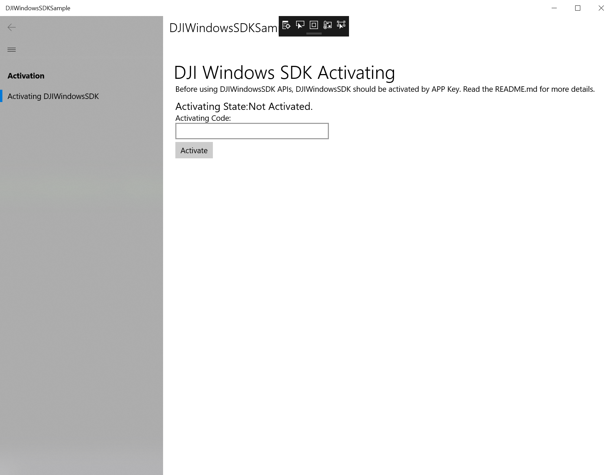
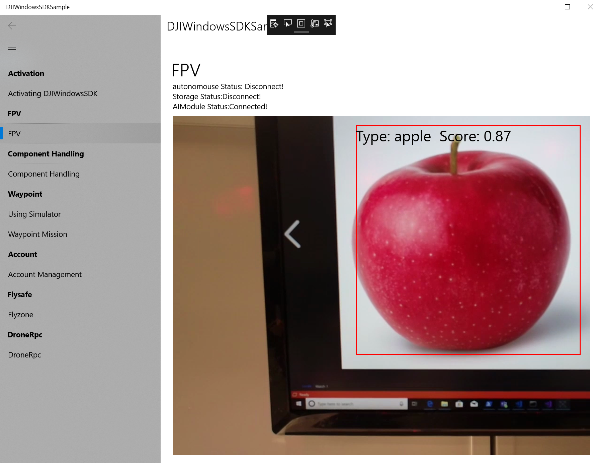
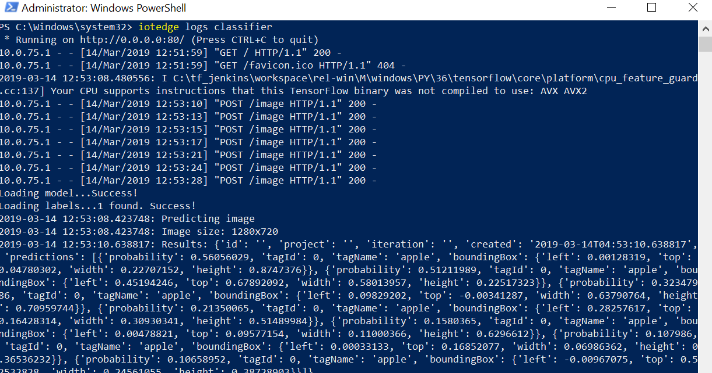

# DJI UWP Sample on Azure IoT Edge Device with Azure Custom Vision Service

Azure IoT Edge can make your IoT solution more efficient by moving workloads out of the cloud and to the edge. 
This capability lends itself well to services that process a lot of data, like computer vision models. 

## Azure Custom Vision Service

The [Custom Vision Service](https://docs.microsoft.com/en-us/azure/cognitive-services/custom-vision-service/home) lets you build custom image classifiers and deploy them to devices as containers. 

Together, these two services enable you to find insights from images or video streams without having to transfer all of the data off site first. Custom Vision provides a classifier that compares an image against a trained model to generate insights. 

For example, Custom Vision on an IoT Edge device could determine whether a highway is experiencing higher or lower traffic than normal,
or whether a parking garage has available parking spots in a row. These insights can be shared with another service to take action. 

In this tutorial, you will learn how to

- [Build an image classifier with Custom Vision](https://github.com/LiangJy123/DJI-IotEdge/blob/master/doc/HowToUseAzureCustomVisionService.md#build-an-image-classifier-with-custom-vision).
- [Create an IoT Edge solution](https://github.com/LiangJy123/DJI-IotEdge/blob/master/doc/HowToUseAzureCustomVisionService.md#create-an-iot-edge-solution).
- [Build and deploy your IoT Edge solution](https://github.com/LiangJy123/DJI-IotEdge/blob/master/doc/HowToUseAzureCustomVisionService.md#build-and-deploy-your-iot-edge-solution).
- [Evaluate the result on UWP](https://github.com/LiangJy123/DJI-IotEdge/blob/master/doc/HowToUseAzureCustomVisionService.md#evaluate-the-results-on-uwp).
- [Send the results of the image classifier to IoT Hub](https://github.com/LiangJy123/DJI-IotEdge/blob/master/doc/HowToUseAzureCustomVisionService.md#send-the-results-of-image-classifier-to-iot-hub).

## Prerequisites

**An Azure IoT Edge device:**

|Operation System | Support |
|:---|:---|
|Windows 10 Desktop 1809 or later | Yes |
|Windows Server 2016 | Yes |
|Windows Server 2019 | Yes |

A device installed above OS and [Azure IoT Edge runtime](https://docs.microsoft.com/en-us/azure/iot-edge/quickstart).

**Cloud resources:**

- A standard-tier [IoT Hub](https://docs.microsoft.com/en-us/azure/iot-hub/iot-hub-create-through-portal) in Azure. 
- A container registry. This tutorial uses [Azure Container Registry](https://docs.microsoft.com/en-us/azure/container-registry/). 
- Know the credentials for your container registry [admin account](https://docs.microsoft.com/en-us/azure/container-registry/container-registry-authentication#admin-account).

**Development resources:**

- [Python](https://www.python.org/downloads/)
- [Git](https://git-scm.com/downloads)
- [Visual Studio Code](https://code.visualstudio.com/)
- [Azure IoT Edge](https://marketplace.visualstudio.com/items?itemName=vsciot-vscode.azure-iot-edge) extension for Visual Studio Code
- [Python extension](https://marketplace.visualstudio.com/items?itemName=ms-python.python) for Visual Studio Code
- [Docker CE](https://docs.docker.com/install/)

## Build an image classifier with Custom Vision

To build an image classifier, you need to create a Custom Vision project and provide training images. For more information about the steps that you take in this section, see How to build a [classifier with Custom Vision](https://docs.microsoft.com/en-us/azure/cognitive-services/custom-vision-service/getting-started-build-a-classifier).

Once your image classifier is built and trained, you can export it as a Docker container and deploy it to an IoT Edge device. 

### Create a new project

**1.** In your web browser, navigate to the [Custom Vision web page](https://customvision.ai/).

**2.** Select **Sign in** and sign in with the same account that you use to access Azure resources. 

**3.** Select **New project**.


**4.** Create your project with the following values:


**5.** Select **Create project**.

### Upload images and train classifier

Creating an image classifier requires a set of training images, as well as test images. 

**1.** Prepare sample images for training and testing your classifier.

**2.** Return to your Custom Vision project and select Add images.


**3.** Select all images in the folder and then Open. 

**4.** Select Upload files. 
(notes: Object Detection model needs at least 15 images per class)


**5.** Tag the images with dragging bounds and labelling.

**6.** When all of images are tagged, select **Train** to train the classifier. 


### Export your classifier

**1.** After training your classifier, select **Export** on the Performance page of the classifier. 

**2.** Select **DockerFile** for **Windows** OS version.


**3.** Select **Export** and then **Download** the .zip file.


## Create an IoT Edge solution

Now you have the files for a container version of your image classifier on your development machine. In this section, you configure the image classifier container to run as an IoT Edge module. 

### Create a new solution

A solution is a logical way of developing and organizing multiple modules for a single IoT Edge deployment. A solution contains code for one or more modules as well as the deployment manifest that declares how to configure them on an IoT Edge device.

1. In Visual Studio Code, select **View** > **Terminal** to open the VS Code integrated terminal.

2. In the integrated terminal, enter the following command to install (or update) **cookiecutter**, which you use to create the IoT Edge python module template in VS Code:

```cmd
pip install --upgrade --user cookiecutter
```

(Notes: Ensure the directory where cookiecutter will be installed is in your environment’s `Path` in order to make it possible to invoke it from a command prompt.)

3. Select **View** > **Command Palette** to open the VS Code command palette. 

4. In the command palette, enter and run the command **Azure IoT Edge: New IoT Edge solution**. In the command palette, provide the following information to create your solution: 

|Steps |Description |
|:--- |:--- |
|Select folder |Choose the location on your development machine for VS Code to create the solution files. |
|Provide a solution name |Enter a descriptive name for your solution, like **CustomVisionSolution**, or accept the default. |
|Select module template |Choose **Python Module**. |
|Provide a module name |Name your module **classifier**. <br> It's important that this module name be lowercase. IoT Edge is case-sensitive when referring to modules, and this solution uses a library that formats all requests in lowercase. |
|Provide Docker image repository for the module |An image repository includes the name of your container registry and the name of your container image. Your container image is prepopulated from the last step. Replace **localhost:5000** with the login server value from your Azure container registry. You can retrieve the login server from the Overview page of your container registry in the Azure portal. The final string looks like **<registry name>.azurecr.io/classifier**. |

### Add image classifier

The Python module template in Visual Studio code contains some sample code that you can run to test IoT Edge. You won't use that code in this scenario. Instead, use the steps in this section to replace the sample code with the image classifier container that you exported previously. 

1. In your file explorer, browse to the Custom Vision package that you downloaded and extracted. Copy all the contents from the extracted package. It should be two folders, **app** and **azureml**, and two files, **Dockerfile** and **README**. 
2. In your file explorer, browse to the directory where you told Visual Studio Code to create your IoT Edge solution. 
3. Open the classifier module folder. If you used the suggested names in the previous section, the folder structure looks like **CustomVisionSolution / modules / classifier**. 
4. Paste the files into the **classifier** folder. 
5. Open the **module.json** file in the classifier folder. 
6. Update the **platforms** parameter to point to the new Dockerfile that you added, and remove the ARM32 architecture and AMD64.debug options. **Save** the changes.

```json
"platforms": {
    "amd64": "./Dockerfile"
}
```

### Prepare a deployment manifest

So far in this tutorial you've trained a Custom Vision model to classify images of trees, and packaged that model up as an IoT Edge module. Now, you're ready to create the deployment manifest that will tell an IoT Edge device how to start and run the module. 

The IoT Edge extension for Visual Studio Code provides a template in each IoT Edge solution to help you create a deployment manifest. 

**1.** Open the **deployment.template.json** file in the solution folder.
 
**2.** Find the **modules** section, which should contain two modules: the one that you created, classifier, and a second that's included by default, tempSensor. 

**3.** Delete the **tempSensor** module with all of its parameters. This module is included to provide sample data for test scenarios, but we don't need it in this deployment. 

**4.** If you named the image classification module something other than classifier, check the name now and ensure that it's all lowercase. The cameraCapture module calls the classifier module using a requests library that formats all requests in lowercase, and IoT Edge is case-sensitive. 

**5.** Update the **createOptions** parameter for the classifier module with the following JSON. 

```json
"createOptions": {
                "HostConfig": {
                  "PortBindings": {
                    "80/tcp": [
                      {
                        "HostPort": "23114"
                      }
                    ]
                  }
                }
              }

```

**6.** **Save** the changes.

### Add registry credentials

The prerequisites for this tutorial listed a container registry, which is necessary to store the container images for the modules that you created. You need to provide access credentials for your registry in two places: in Visual Studio Code so that you can build and push your images to the registry, and in the deployment manifest so that your IoT Edge device can pull and deploy the images. 

If you're using Azure Container Registry, make sure you know the username, login server, and password for the [admin account](https://docs.microsoft.com/en-us/azure/container-registry/container-registry-authentication#admin-account). 

1. In Visual Studio Code, open the integrated terminal by selecting **View** > **Terminal**. 
2. Enter the following command in the integrated terminal: 
```powershell
docker login -u <registry username> <registry login server>
```
3. When prompted, provide your registry password and press **Enter**.
4. Open the **.env** file in the solution folder. This file is git ignored and stores your registry credentials so that you don't have to hardcode them into the deployment template file. 
```env
CONTAINER_REGISTRY_USERNAME=<registry username>
CONTAINER_REGISTRY_PASSWORD=<registry password>
```
5. Provide the username and password for your container registry, without quotation marks around the values. **Save** the .env file.

## Build and deploy your IoT Edge solution

With the module created and the deployment manifest template configured, you're ready to build the container images and push it to your container registry. 

Once the images are in your registry, you can deploy the solution to an IoT Edge device. You can set modules on a device through the IoT Hub, but you can also access your IoT Hub and devices through Visual Studio Code. In this section, you set up access to your IoT Hub then use VS Code to deploy your solution to your IoT Edge device.

First, build and push your solution to your container registry. 

1. In the VS Code explorer, right-click the **deployment.template.json** file and select **Build and push IoT Edge solution**. You can watch the progress of this operation in the integrated terminal in VS Code. 
2. Notice that a new folder was added to your solution, config. Expand this folder and open the deployment.json file inside.
3. Review the information in the deployment.json file. The deployment.json file is created (or updated) automatically based on the deployment template file that you configured and information from the solution, including the .env file and the module.json files. 

Next, set up access to your IoT Hub from within Visual Studio Code.

1. In the VS Code command palette, select **Azure IoT Hub: Select IoT Hub**.
2. Follow the prompts to sign in to your Azure account. 
3. In the command palette, select your Azure subscription then select your IoT Hub. 

Finally, select your device and deploy your solution.

1. In the VS Code explorer, expand the **Azure IoT Hub Devices** section. 
2. Right-click on the device that you want to target with your deployment and select **Create deployment for single device**. 
3. In the file explorer, navigate to the config folder inside your solution and choose **deployment.json**. Click Select **Edge deployment manifest**. 

If the deployment is successful, a confirmation message is printed in the VS Code output. In the VS Code explorer, expand the details about the IoT Edge device that you used for this deployment. Hover your cursor on the **Azure IoT Hub Devices** header to enable the refresh button if the modules don't show up right away. It may take a few moments for the modules to start and report back to IoT Hub. 

You can also check to see that all the modules are up and running on your device itself. On your IoT Edge device, run the following command to see the status of the modules. It may take a few moments for the modules to start.

```bash
iotedge list
```


## Evaluate the results on UWP

The repo provide the [sample UWP code]() to connect DJI drone with the Azure Custom Vision model on IoT Edge Device.
Now you can connect DJI drone to the IoT Edge Device than Run the sample code.

### Build and Run the UWP

1. Open the **DJIWindowsSDKSample.sln** with Visual Studio 2017.
2. Make sure the develop mode is **debug** and platform is **x86**.
3. **Run** the sample
4. Press **Activate** button.

5. Select **FPV** on the left navigator.


### Check the logs on classifier module

You can see the logs of iotedge module by:

```bash
iotedge logs <module name>
```



## Send the results of image classifier to IoT Hub

### IoT Hub Client

This section is **optional** for testing Custom Vision model. 
In a real Custom Vision deployment, you would have a camera providing live images or video streams. For this scenario, you simulate the camera by building a module that sends a test image to the image classifier. 

Follow this [guide](https://docs.microsoft.com/en-us/azure/iot-edge/tutorial-deploy-custom-vision#create-a-simulated-camera-module).
